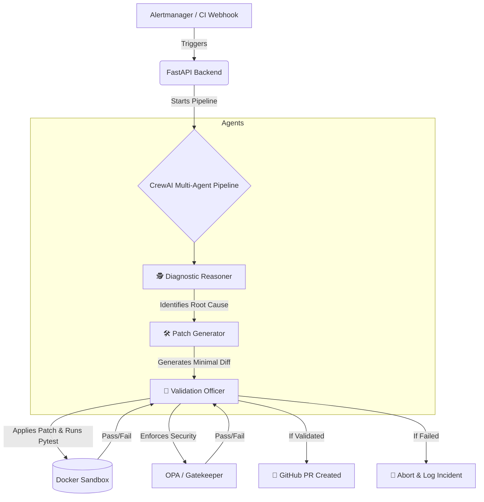

# 👻 GhostOps

GhostOps is an autonomous AIOps platform that acts as an AI-driven Site Reliability Engineer (SRE). Instead of just alerting humans when something breaks, GhostOps detects real incidents, diagnoses the root cause, writes a code fix, validates the patch in a secure sandbox, and opens a GitHub Pull Request—all autonomously.

## 🚀 Project Overview

When an incident occurs (e.g., a memory leak or a CI test failure), GhostOps springs into action:
1. **Detection:** Prometheus and Alertmanager detect anomalies in the cluster and fire webhooks to the GhostOps FastAPI backend.
2. **Diagnosis:** A multi-agent AI pipeline built on [CrewAI](https://github.com/joaomdmoura/crewAI) and powered by Claude (Anthropic) analyzes the failure context (logs, metrics, source code, and past incidents).
3. **Remediation:** A minimal code fix (git patch) is generated.
4. **Validation:** The patch is strictly validated in an isolated, ephemeral Docker sandbox to ensure tests pass and it complies with OPA (Open Policy Agent) security policies.
5. **Deployment:** If (and only if) validation passes, a real GitHub PR is opened for human review, complete with an explanation and evidence.

---

## 🏗️ Architecture & Pipeline Flow

The core of GhostOps is a sequential 3-agent pipeline orchestrated by CrewAI:



---

## 🛠️ Tech Stack

*   **Infrastructure:** Kubernetes (Kind), Terraform, Docker
*   **Observability:** Prometheus, Alertmanager, Grafana, Jaeger / OpenTelemetry
*   **Security & Policy:** HashiCorp Vault (Secrets), OPA / Gatekeeper (Policy Enforcement)
*   **Chaos Engineering:** Chaos Mesh
*   **Backend & Orchestration:** Python, FastAPI, CrewAI
*   **LLM Provider:** Claude API (`anthropic/claude-sonnet-4-6` via LiteLLM)
*   **Continuous Deployment:** ArgoCD

---

## 💻 Setup & Installation

To run GhostOps locally, you'll need Docker, `kind`, `kubectl`, `helm`, and `python3`.

1. **Spin up the Cluster:**
   ```bash
   kind create cluster --config infra/kind/kind-config.yaml
   ```
2. **Apply Infrastructure (Monitoring, OPA, Chaos Mesh):**
   ```bash
   kubectl apply -f infra/k8s/monitoring/
   kubectl apply -f infra/k8s/gatekeeper/
   helm repo add chaos-mesh https://charts.chaos-mesh.org
   helm install chaos-mesh chaos-mesh/chaos-mesh -n chaos-mesh --create-namespace --version 2.7.0
   ```
3. **Set Up the Backend:**
   ```bash
   python3 -m venv venv
   source venv/bin/activate
   pip install -r backend/requirements.txt -r agents/requirements.txt
   ```
4. **Environment Variables:**
   Ensure you have a `.env` file or Vault running with your `ANTHROPIC_API_KEY` and `GITHUB_TOKEN`.
5. **Run the API & Agents:**
   ```bash
   uvicorn backend.main:app --reload --port 8000
   ```
   *(Ensure port-forwards for Jaeger (4317), Prometheus (9090), and Grafana (3000) are active if viewing telemetry).*

---

## 🎯 Triggering a Demo Incident

GhostOps is designed to respond to real failures. You can trigger incidents in two ways:

1. **Manual Endpoint Trigger:**
   Hit the sample application's leak endpoint repeatedly to simulate a memory leak:
   ```bash
   for i in {1..10}; do curl http://localhost:5000/leak; done
   ```
   This triggers Alertmanager based on Prometheus memory metrics.

2. **Chaos Mesh Injection:**
   Deploy the predefined `StressChaos` experiment to automatically inject high memory consumption in the cluster, forcing the pipeline to react dynamically.

---

## 🏆 Real Example Resolutions

GhostOps has been proven to resolve complex issues end-to-end. Here are two real examples of the AI pipeline diagnosing a problem and submitting a correct, validated fix:

*   **Example 1 (Memory Leak):** 
    Detected a growing cache issue in `app.py`. The pipeline identified the unbounded growth, generated a fix to implement an LRU cache or max-size limit, validated it, and opened a PR. 
    👉 [**View PR #3**](https://github.com/likith1231/ghostops/pull/3)

*   **Example 2 (CI Test Failure):**
    A logic defect in `math_utils.py` (using `+` instead of `*`) caused `pytest` to fail in CI. GhostOps intercepted the failure, isolated the bug to the specific function, fixed the mathematical operator, validated it against the OPA allowlist, and opened a PR.
    👉 [**View PR #4**](https://github.com/likith1231/ghostops/pull/4)

---

## ⚠️ Known Limitations

GhostOps is currently a localized Proof of Concept and is **not yet production-hardened**:
*   **Local-Only Deployment:** Assumes a local `kind` cluster environment.
*   **Vault in Dev Mode:** HashiCorp Vault is running in `-dev` mode with HTTP. In production, TLS and proper auto-unseal must be configured.
*   **Manual OPA Updates:** The OPA Gatekeeper allowlist (`allowlist.rego`) strictly dictates which files the AI is permitted to patch. Currently, new authorized files (like `app.py` or `math_utils.py`) must be manually added to the policy.
*   **API Rate Limits:** The multi-agent pipeline is token-heavy and reliant on the Claude API limits. Extensive debugging sessions may trigger rate-limiting errors (`429 Resource Exhausted`).
